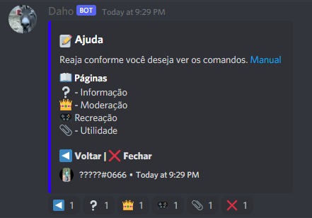

  
❓ What is this?
- A discord bot written in JavaScript with NodeJS.

  

  
⚙️ Used technologies:
- NodeJS.

  
🔧 Setup:
- Clone this repository: 
`git clone https://github.com/z3ox1s/discordbot-js` or Download ZIP and unzip;  
- Move to repository: 
`cd discordbot`;  
- Install all NodeJS dependencies: 
`npm install`;  
- config.json: 
`Add your BOT to 'token' line on config.json`;  
- Run: 
`npm start` or `npm run start`;  

📖 Dependencies:
- <a href="https://nodejs.org">NodeJS</a>
